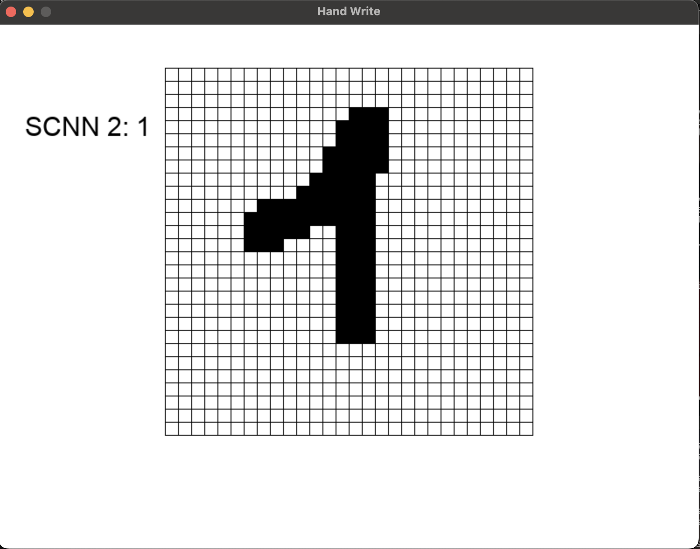
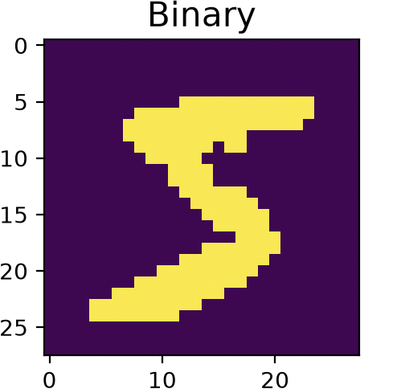
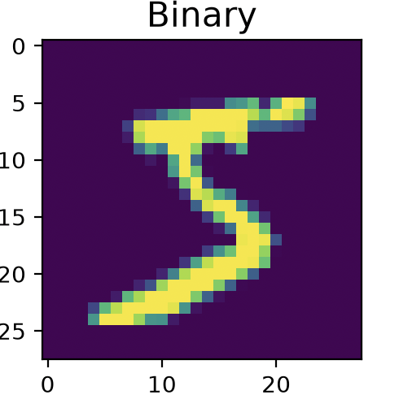

# HandWrite
Hand write a number in the drawing interface (for the moment) and it recognizes it (kinda)

## Description
I used MNSIT data for training. It was a collection of handwritten digits (ranging from 0 to 9). I had 60 000 images as training data and 10 000 images as test data. Each image have a label.

I wrote 4 models:
- NN (Simple Neural Network) from scratch with NumPy
- CNN (Convolutional Neural Network) from scratch with NumPy
- SCNN 1 (CNN trained with the help of binary data) with PyTorch
- SCNN 2 (CNN trained with the help of grayscale data) with PyTorch

I will test all these models in a drawing interface.

  

## Data type
I used two types of data, grayscale and binary. First, for both of them we have a vector of 784 numbers. Each number represent the level of darkness of a pixel (0 to 255)

### Binary
Binary data are like boolean data. If the pixel originally have a number higher than 0, its new value is 1.
I use binary data to train the NN, CNN and SCNN1. I did that because I made the assumption that these models would perform better on the drawing interface. The reason I made that assumption is that the input for the drawing interface and the training data both have boolean value for their pixel.

  

### Grayscale
Grayscale is a float. The value the pixel can get is between 0 and 1, depending how dark the pixel is. I just normalized the value of the pixel. It's richer in information than binary. I used it to train SCNN2.

  

## Models

### Neural Network
For the Neural Network, I used NumPy. For this model, I used ReLU as the nonlinear activation function. For the last neuron, I used softmax as my normalization function. As for the optimization, SGD was used for this model. It was a very simple NN that could reach 99% during training with 0.01 as a learning rate, 60 images for each batch and 16 epochs. But its accuracy with the drawing interface is barely 49%. I use binary data (MNIST) to train it.

### Convolutional Neural Network
For the Convolutional Neural Network, I used NumPy. I made the filter calculation with NumPy, but this is not fast enough. In the next step, I used a reLU and MaxPool. I used reLU and convolutional_biases for "the learning of the filter operation". This convolutional step is slow due to the fact that it wasn't "optimized" with better linear algebra. But, for the multi layer perceptron, I used the same algorithm as the Neural Network. SGD was also used for the training of the convolutional_biases. I trained a model with 0.01 as its learning rate, a batch of 10 images for 1 epoch. It gave almost 84% of accuracy. Its accuracy with the drawing interface is 50%. I use binary data (MNIST) to train it.

### Convolutional Neural Network with PyTorch
I made two Convolutional Neural Networks with PyTorch, I called them SCNN1 and SCNN2. SCNN stands for Super Convolutional Neural Network.
PyTorch accelerate the training. In this model, the image goes trough the filters, reLU, and then the pool (Maxpool). I trained two networks with two types of the same data, one binary and the other one grayscale.
Their accuracy with test data:

#### The binary model: 

98.21% accuracy with binary data
97.62% accuracy with grayscale data

#### The grayscale model: 

96.57% accuracy with binary data
98.61% accuracy with grayscale data 

For the drawing interface, you would assume SCNN1 (the grayscale one) would be better, but it's the opposite. SCNN2 outperformed SCNN1. SCNN1 got 60% accuracy and SCNN2 got 64% accuracy.
